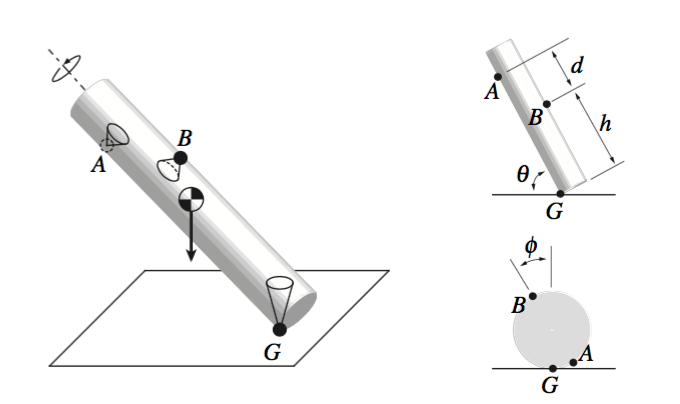

# Force-closure test with three point contacts

This Matlab software checks if a given grasp of three frictional contacts can be in force-closure. It is customized to cylindrical objects.

## Input

To run the software, provide three parameters:
```
>>is_forceclosure(H, THETA, PHI)
```
The three parameters specify the locations of the three contacts at A, B, and G as depicted in the figure below.

## Output

